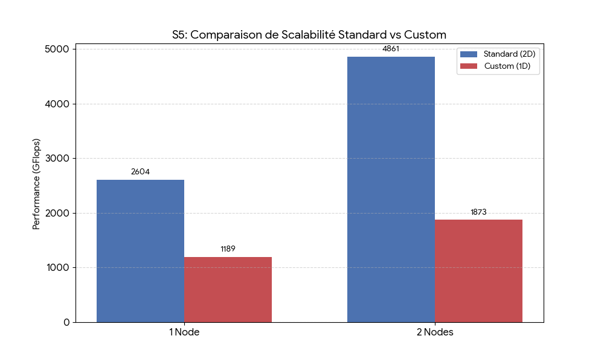
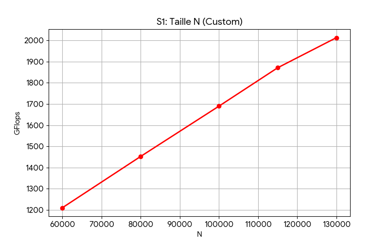
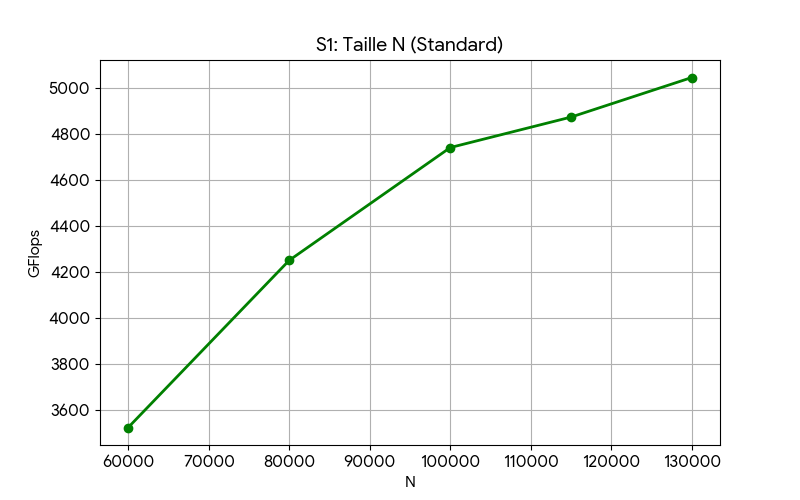
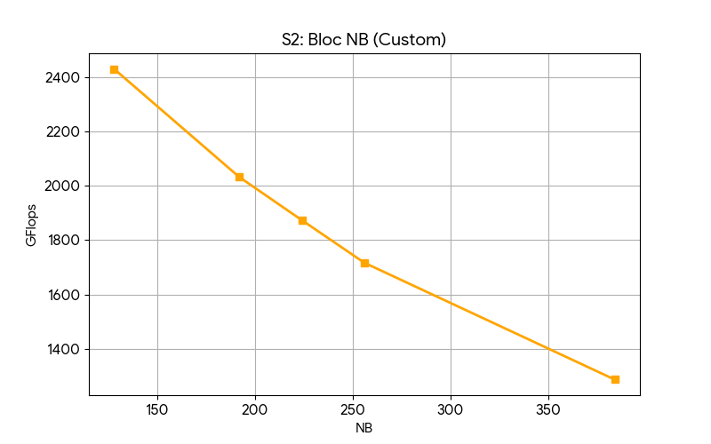
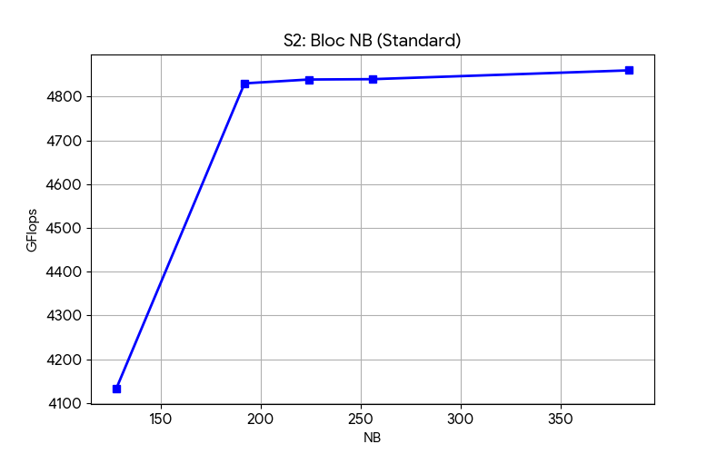
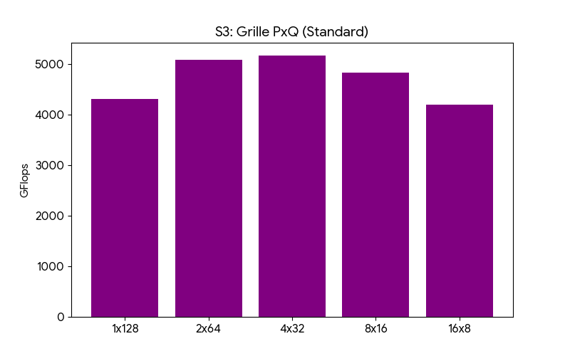

# MPNA-HPL : Analyse de Performance et Implémentation Distribuée

**Projet :** Calcul Haute Performance & Programmation Parallèle
**Support :** Supercalculateur ROMEO (Architecture AMD EPYC "Milan" Zen 3)

Ce dépôt documente nos travaux sur le benchmark HPL (High-Performance Linpack). L'objectif est d'analyser les facteurs limitants de l'algèbre linéaire dense sur architecture distribuée en comparant l'implémentation de référence (Netlib) à une implémentation personnalisée développée en C/MPI/BLAS.

---

## Architecture du Dépôt

### 1. Implémentation Standard (`hpl_standard/`)
Ce dossier contient l'environnement de référence pour établir la performance maximale (Rpeak/Rmax) de la machine.
* **`HPL.dat`** : Configuration du benchmark ($N=100k$, $NB=224$, Grille $P \times Q = 8 \times 16$).
* **`Make.Romeo`** : Fichier de compilation optimisé (flags `-march=znver3`, bibliothèques AOCL et BLIS).
* **`install.sh`** : Script d'automatisation (téléchargement, compilation, exécution des séries de tests).

### 2. Implémentation Personnalisée (`hpl_custom/`)
Implémentation pédagogique d'une factorisation LU distribuée.
* **`hpl_custom.c`** : Code source du solveur (distribution 1D, sans pivotage).
* **`test_plan.sh`** : Générateur de tests (Séries S1 à S5) et des scripts de soumission Slurm.

---

## Analyse Technique de l'Implémentation Custom

Pour isoler les mécanismes fondamentaux, nous avons effectué des choix de conception simplificateurs par rapport à la norme HPL, ce qui a des conséquences directes sur les performances mesurées.

### Distribution des Données : 1D vs 2D
Nous utilisons une **distribution cyclique par blocs de colonnes (1D)**.
* **Justification :** Simplification de l'indexation et de la gestion mémoire. Chaque processus possède des colonnes entières, éliminant le besoin de communication verticale intra-panneau.
* **Conséquence :** Cette approche crée un goulot d'étranglement sur les communications. Lors de la diffusion du panneau (`MPI_Bcast`), le flux de données traverse $P-1$ processus (broadcast global), contrairement à $Q-1$ dans une grille 2D.

### Algorithme Right-Looking et Déséquilibre de Charge
L'algorithme alterne entre une phase séquentielle (factorisation du panneau par un seul processus) et une phase parallèle (mise à jour de la traîne).
* **Phénomène :** À mesure que le calcul avance, la partie parallèle (la sous-matrice à mettre à jour) diminue, tandis que le coût fixe de la factorisation du panneau et de la latence MPI reste constant.
* **Impact :** Sur la distribution 1D, le déséquilibre de charge est critique. Les processus passent un temps croissant en état d'attente (Idle) pendant que le propriétaire du bloc courant effectue la factorisation.

---

## Analyse des Résultats et Performances

### 1. Comparaison Globale et Scalabilité (Série S5)

Le graphique ci-dessus illustre la différence d'efficacité parallèle entre les deux approches sur 1 et 2 nœuds (64 et 128 cœurs).

* **Standard (Bleu)** : La performance passe de 2604 à 4861 GFlops. Le scaling est quasi-linéaire (x1.86) grâce à la distribution 2D et au "Look-ahead" qui masque les communications.
* **Custom (Rouge)** : La performance passe de 1189 à 1873 GFlops (x1.57). L'efficacité s'effondre lors du passage à l'échelle. Le surcoût de la communication collective (`MPI_Bcast`) sur 128 processus commence à dominer le temps de calcul.

### 2. Impact de la Taille de Matrice N (Série S1)

| HPL Custom | HPL Standard |
| :---: | :---: |
|  |  |

* **Observation :** Les deux implémentations affichent une croissance de performance avec la taille de la matrice $N$.
* **Analyse :** C'est un comportement attendu en algèbre linéaire dense. Le volume de calcul augmente en $O(N^3)$ alors que le volume de communication augmente en $O(N^2)$. Augmenter $N$ permet donc d'amortir le coût des communications et d'augmenter l'intensité arithmétique. Cependant, le code standard atteint plus rapidement un plateau proche du pic théorique.

### 3. Impact de la Taille de Bloc NB (Série S2)

C'est sur ce paramètre que la différence architecturale est la plus marquante.

| HPL Custom | HPL Standard |
| :---: | :---: |
|  |  |

* **HPL Standard (Bleu) :** La performance augmente avec $NB$ pour se stabiliser vers 256. De plus gros blocs favorisent l'efficacité des routines BLAS-3 (cache L3) et réduisent la fréquence des messages MPI.
* **HPL Custom (Orange) :** La performance **diminue** quand $NB$ augmente.
    * **Explication :** Dans notre distribution 1D, quand $NB$ est grand, le processus propriétaire du panneau travaille seul pendant une longue période (phase séquentielle), bloquant tous les autres processus. Un petit $NB$ (ex: 128) améliore la granularité et réduit ce temps d'attente ("Pipeline stall").

### 4. Impact de la Grille de Processus (Série S3 - Standard)

* **Analyse :** Ce test valide l'intérêt de la distribution 2D. Les configurations extrêmes "plates" (1x128) ou "hautes" (16x8) sous-performent comparées aux configurations quasi-carrées (4x32 ou 8x16). Une grille carrée minimise le périmètre de la sous-matrice locale, et donc le volume de données à échanger avec les voisins.

